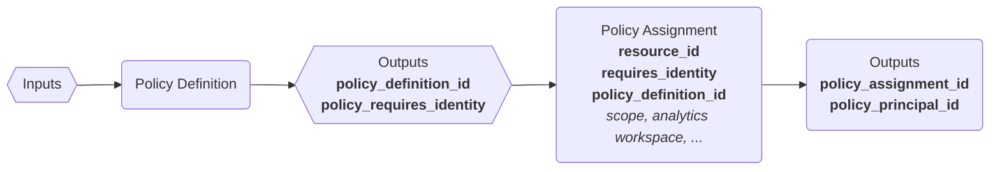

# Terraform Module: Azure Policy Definition
[](https://github.com/nhsdigital/terraform-azurerm-policy-definition/actions)
[](https://www.terraform.io/)
[](./LICENSE)
[](https://learn.microsoft.com/en-us/azure/governance/policy/overview)

This module allows you to define and deploy custom Azure Policy Definitions to subscriptions, resource groups and resources using Terraform and `azurerm_policy_definition` resource.

## ➕ Features

- Declarative policy rule configuration
- Support for metadata and parameters

## 📦 Usage

```hcl
module "example_policy_definition_deny_public_ip" {
  source       = "../policy-definition"
  name         = "deny-public-ip"
  display_name = "Deny Public IP"
  description  = "Denies creation of public IP addresses"
  policy_rule = {
    if = {
      field  = "type"
      equals = "Microsoft.Network/publicIPAddresses"
    }
    then = {
      effect = "deny"
    }
  }
  metadata = {
    owner = "<support email>"
  }
}
```

## Module Structure

The policy module is structured as shown below:

<pre><code>
📁 Infrastructure/
└── 📁 modules/
     └── 📁 policy/
        ├── 📁 examples/
        ├── 📁 policy-initiatives/
        ├── 📁 policy-definition/
        ├── 📁 policy-assignments/
        └── 📁 policy-remediation/
</code></pre>

- **policy** - contains all modules related to policy functionality
- **examples** - simple examples of using the policy modules
- **policy-initiatives** - supports policy "initiatives" – groups of policies
- **policy-definition** - supports defining a policy
- **policy-assignment** - assigns policies to a subscription, resource group, or resource
- **policy-remediation** - TBC

Each folder has its relevant `main.tf`, `variables.tf`, and `outputs.tf` files. This structure allows us to focus on _what_ can be done with policies.

<br>

## Security Requirements

This module requires the executing user to have **Resource Policy Contributor** RBAC role assigned. The **Resource Policy Contributor** role provides the following two required permissions:

- **Create** policy definitions
- **Create** policy assignments

If this role is not assigned, then performing `terraform apply` will result in the following Azure RM error:

```sh
Error: creating/updating Policy Definition "XXXX": policy.DefinitionsClient#CreateOrUpdate: Failure responding to request: StatusCode=403 -- Original Error: autorest/azure: Service returned an error. Status=403 Code="AuthorizationFailed" Message="The client 'YYYY@hscic.gov.uk' with object id 'ZZZZZ' does not have authorization to perform action 'Microsoft.Authorization/policyDefinitions/write' over scope '/subscriptions/AAAAA/providers/Microsoft.Authorization/policyDefinitions/XXXX' or the scope is invalid. If access was recently granted, please refresh your credentials."
```

## Module Inputs and Outputs

The following section details the important input and output values provided/required by each module.

### General Flow of Outputs



### Module: Policy Definition

#### 📤Inputs

| Name | Type | Default | Description |
|--------------|--------|---------|--------------------------------------|
| `name`         | string | n/a     | The name of the policy definition. |
| `display_name` | string | n/a     | Display name of the policy.        |
| `description`  | string | ""      | Description of the policy.         |
| `policy_type` | string | "custom" | Whether this is a builtin or custom policy |
| `policy_rule`  | any    | n/a     | The actual definition of the policy rule. |
| `mode`         | string | "All"   | Whether the policy operates in resource manager or provider mode. |
| `metadata`     | any    | `{}`    | Custom metadata block attached to the policy. |
| `parameters`   | any    | `{}`    | Additional custom parameters for this policy. |

<br>

#### 📤 Outputs

| Name | Description |
|-|-|
| `policy_definition_id` | The identifier of the created policy definition. |
| `policy_requires_identity` | This is true if the policy's `effect` requires use of an identity. This value must be provided to `policy_assignment` in order to correctly create an appropriate role |

<br>

### Module: Policy Assignment

Policy assignment supports creating assignments for *subscriptions**, **resource groups**, and **resources**. It conditionally activates either `azurerm_resource_policy_assignment`, `azurerm_resource_group_policy_assignment` or `azurerm_subscription_policy_assignment` based on the type of **`resource_id`** provided as input.

#### 📤 Inputs

| Name | Type | Default | Description |
|--------------|--------|---------|--------------------------------------|
| `name`         | string | n/a     | The name of the policy assignment. |
| `resource_id` | string | n/a     | Can be the identifier of a subscription, resource group or resource. |
| `policy_definition_id`  | string | ""      | The identifier of a policy definition to create an assignment to. |
| `enforce` | bool | false | Whether to enforce this assignment or not. |
| `location`  | string    | "uksouth"     | If `requires_identity` is true, this value is required. |
| `requires_identity`         | bool | n/a   | Whether this policy assignment must have managed identity or not. _Note: the `policy-definition` module will determine this value. |

#### 📤Outputs

| Name | Description |
|-|-|
| `policy_assignment_id` | The identifier of the created policy assignment. |
| `policy_principal_id` | This identifier of the managed identity assigned (if required) |

<br>

## 🧪 Testing the Module

### **Manual Validation**

1. **Navigate to `examples` folder**

   ```sh
   cd examples
   ```

2. **Initialize & Validate**

   ```sh
   terraform init
   terraform validate
   ```

3. **Plan and Apply (dev environment)**<br>
  :warning: This step will fail if your account does not have the **Resource Policy Contributor** role.

   ```sh
    terraform plan -out=tfplan
    terraform apply tfplan
    ```

4. **Verify**
    Use the Azure CLI or Portal to check:

    ```powershell
    az policy definition show --name deny-public-ip
    ```

<br>

### Automated Validation

🛠️  _automated validation is part of an upcoming release_


This module uses **Terratest**, a Go-based infrastructure testing framework, to verify that policy definitions are correctly deployed to Azure.

#### Why Terratest?

- It ensures our module provisions _expected resources_
- _Validates output values_ and Azure behavior
- Helps to _catch regressions and breaking changes_
- Improves confidence for reusing the module in different environments

#### Running Terratest Locally

1. Ensure that Go 1.20+ is [installed](https://go.dev/learn/).

1. Navigate to your test directory:

    ```sh
    cd infrastructure/modules/policy
    ```

1. Enable dependency tracking for your code:

    ```sh
    go mod init tests

    go get github.com/gruntwork-io/terratest/modules/terraform
    go get github.com/stretchr/testify/assert
    ```

1. Run the test:

    ```sh
    go test -v
    ```

Example test file (located in tests/policy_test.go)

```go
package test

import (
  "testing"
  "github.com/gruntwork-io/terratest/modules/terraform"
  "github.com/stretchr/testify/assert"
)

func TestPolicyDefinition(t *testing.T) {
  t.Parallel()

  terraformOptions := &terraform.Options{
    TerraformDir: "../examples/simple-policy",
  }

  defer terraform.Destroy(t, terraformOptions)

  terraform.InitAndApply(t, terraformOptions)

  output := terraform.Output(t, terraformOptions, "policy_definition_id")
  assert.Contains(t, output, "/providers/Microsoft.Authorization/policyDefinitions/")
}
```

### 📚 Additional Resources

- [Azure Policy Documentation](https://learn.microsoft.com/en-us/azure/governance/policy/overview)
- [azurerm_policy_definition.this](https://registry.terraform.io/providers/hashicorp/azurerm/latest/docs/data-sources/policy_definition) (resource)
- [Terratest Docs](https://terratest.gruntwork.io/docs/getting-started/quick-start/)
