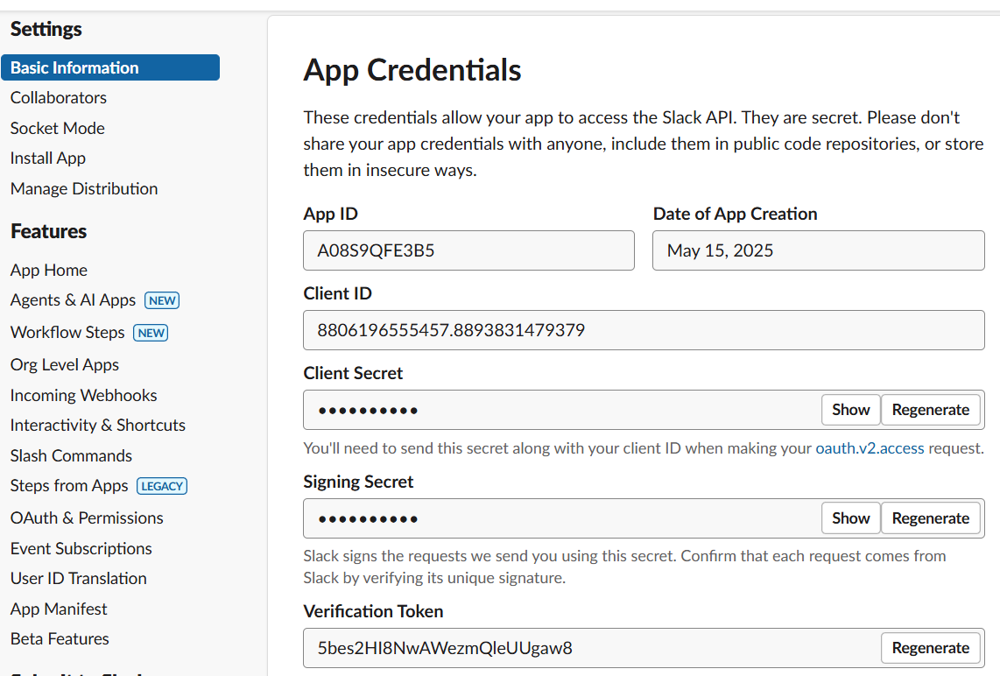
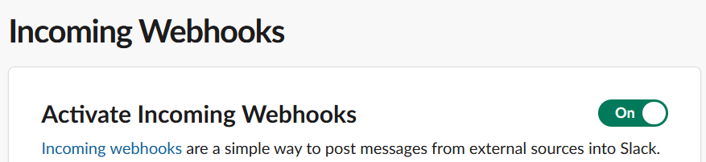
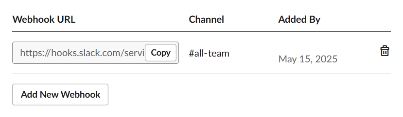

## Why Do We Need This Integration

The Slack integration is designed to notify outcome teams of post-deployment tests or specific deployment activities within their CI/CD pipeline. By centralising notifications, teams maintain visibility of test results, and other key metrics in an assigned communication channel.

## Architecture

* **Security** The Slack Webhook URL must not be hardcoded within pipeline scripts. Instead, we utilise environment variable groups.
* **Scalability** The integration is usable across multiple environments and repositories without requiring changes to the pipeline definitions.
* **Modularity** The notification script is designed as a reusable component, allowing for easy updates to message formats without modifying the core pipeline logic.
* **Error Handling** The scripts handle basic scenarios such as lack of required parameters like the webhook URL, or if test result parsing fails.


## Set Up the Slack App

### Quick and Easy via a Manifest

1. Go to the [My Slack Apps](https://app.slack.com)  and select **Create New App**
1. Select **Create from a manifest**.
1. Select a workspace to register the Slack App inside, and click **Next**.
1. In the _Create app from manifest_ screen, select **YAML** and paste in the manifest code (below):

```yaml
display_information:
  name: Playwright Tests
  description: Receives notifications about test reports in Azure Pipelines.
  background_color: "#062b99"
features:
  bot_user:
    display_name: pw-tests
    always_online: false
oauth_config:
  scopes:
    bot:
      - channels:join
      - chat:write
      - incoming-webhook
      - links:read
      - users:read.email
      - users:read
    user:
      - users:read.email
      - users:read
settings:
  org_deploy_enabled: false
  socket_mode_enabled: false
  token_rotation_enabled: false

```
5. In the _Review summary & create your app_, click **Create**.
5. You will now be navigated to the application configuration.

5. Record all the entires for `App ID`, `Client ID`, `Client Secret`, `Signing Secret`, `Verification Token` etc.
5. Navigate to **Incoming Webhooks** and enable the toggle **Activate Incoming Webhooks**.

5. Scroll down the page to create a webhook endpoint.
5. Click on **Add new webhook**
5. In the next screen, Slack requires permission to generate a webhook inside a selected channel. So, select the appropriate channel you wish the app to post notifications to and click **Allow**.
5. You'll now see the generated URL for the application to post to the specified channel

5. Copy this webhook URL. This URL will be used by the Azure Pipelines and Python script.


> **⚠️Caution!** If you uninstall or reinstalling the Slack App, the previous webhook URL will be invalidated.

## Azure Pipelines

### General Flow
```
          START
            |
            v
|-----------------------------|
|  Parent Pipeline Triggered  |
|-----------------------------|
            |
            +--> Accept Parameters
            |
            v
|----------------------------|
|  Child Pipeline Triggered  |
|----------------------------|
            |
            v
            +--> Repositories
            |
            v
            +--> ...
            |
            v
            +--> Run Tests
            |
            v
            +--> Publish
            |
            v
            +--> Send Notification
            |
            v
           END
```

### Parent Pipeline

The parent pipeline triggers the child pipeline and passes parameters, such as the test project directory and Slack webhook URL to use.

```yaml
- template: .azuredevops/templates/steps/run-post-deployment-pw-tests.yaml@dtos-devops-templates
  parameters:
    serviceConnection: sc-cohort-manager-dev
    testProjectDirectory: 'tests/playwright-tests'
    testfileDirectory: 'src/tests/e2e/testFiles'
    slackWebHook: $(SLACK_WEBHOOK_URL)
```
| Parameter | Meaning | Source |
|-|-|-|
| SLACK_WEBHOOK_URL | This is a unique URL provided by Slack for an installed Slack App's Webhook. | Specified either in the Azure Pipeline's Variable Groups, or set as an environment variable. _Recommend to store this value in the pipeline variable groups._


### Child Pipeline

The child pipeline runs all Playwright tests and publishes the results as an artifact linked to the build. If then generate **JUnit** XML results (`results.xml`) and triggers the Python script with all relevant parameters.

Since the Slack webhook is the most important value required, the pipeline ensures that it can resolve the URL either from the pipeline environment, or from the parameter (`slackWebHook`) passed to the pipeline.

```yaml
- script: |
    if [ -n "${SLACK_WEBHOOK_URL:-}" ]; then
      echo "##vso[task.setvariable variable=envSlackWebhook;isOutput=true]$(SLACK_WEBHOOK_URL)"
    else
      echo "##vso[task.setvariable variable=envSlackWebhook;isOutput=true]${{ parameters.slackWebHook }}"
    fi
  displayName: 'Resolve Slack Webhook URL'
```

The last step in the child pipeline ensures this webhook value is present:

```yaml
- task: PythonScript@0
  displayName: 'Notify - Run Script'
  condition: and(
    eq(variables['resFileScript.hasResults'], 'true'),
    eq(variables['checkScriptPath.hasFile'], 'true'),
    ne(variables['envScript.envSlackWebhook'], '')
    )
```

## Script Arguments

The `SlackIntegrator.py` script accepts several arguments to control notification behavior:

* `-e` or `--env`: Environment related to the build (e.g., dev, prod)
* (**Required**) `-r` or `--reports`: Path to the JUnit test report
* (**Required**) `-w` or `--webhook`: Webhook URL for Slack
* `-u` or `--user`: User who initiated the build
* `-p` or `--pipeline`: Name of the pipeline source
* `-b` or `--branch`: Branch name


`--pipeline` argument allows unique name for each pipeline that ran the Playwright tests. For example, one team could set _'Team Analyse Pipelines'_, another could set _'Cohort Manager Pipelines'_. If this argument is not provided, the script defaults to _'Build Pipelines'_.

If `user` or `branch` are not provided, then the script will substitute `(None)` into the output message.

